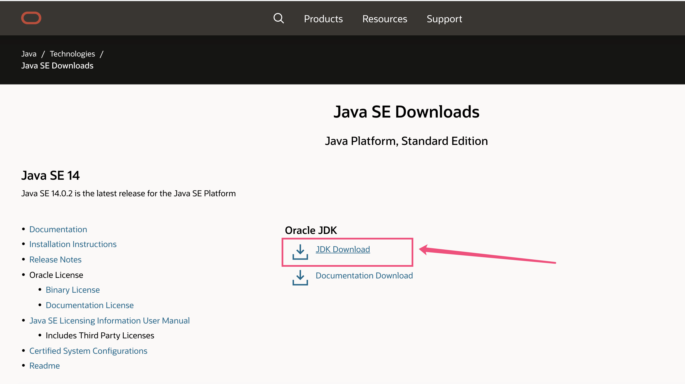
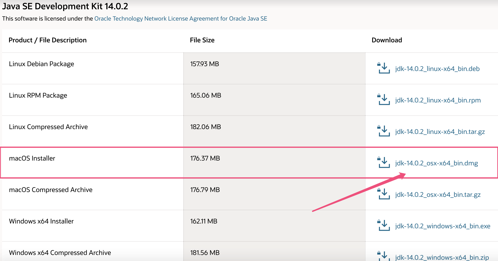
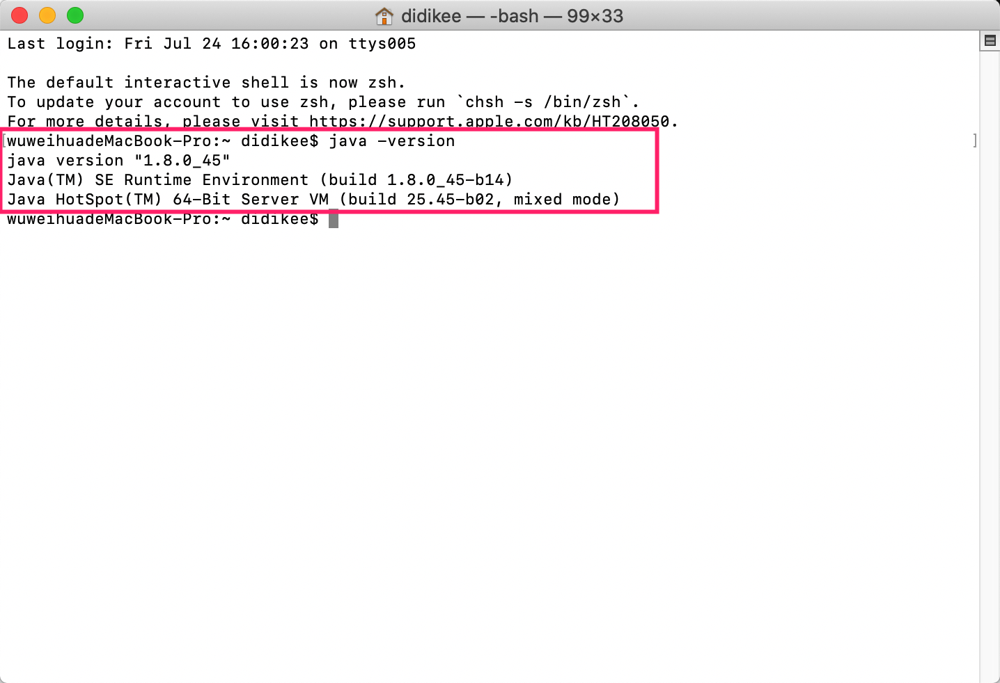
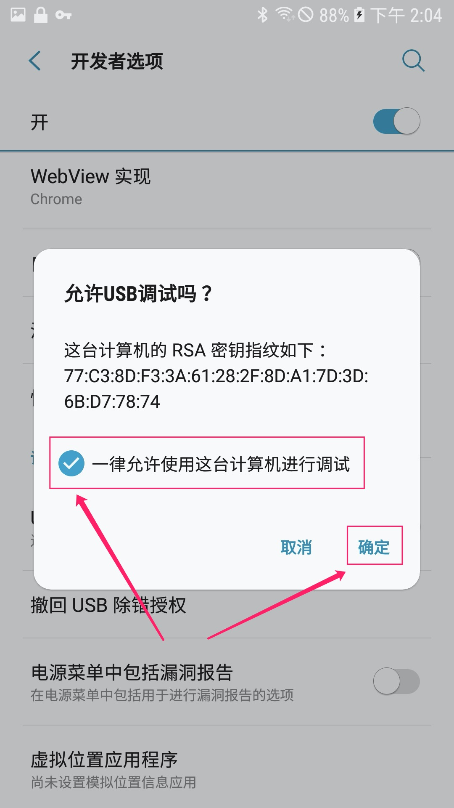
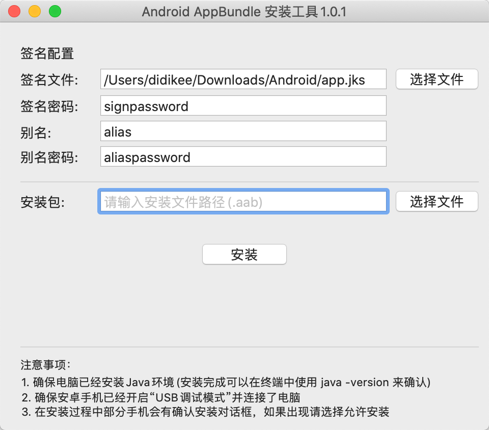

# Android AppBundle(.aab) 安装工具

软件内置了`bundletool.jar` 和 `platform-tools`:

**`bundletool.jar(1.0.0)`**: [https://developer.android.com/studio/command-line/bundletool](https://developer.android.com/studio/command-line/bundletool)

**`platform-tools(29.0.5)`**: [https://developer.android.com/studio/releases/platform-tools](https://developer.android.com/studio/releases/platform-tools)

## 如何使用

### 第一步：安装JDK

进入 oracle官网的JDK下载页：[https://www.oracle.com/java/technologies/javase-downloads.html](https://www.oracle.com/java/technologies/javase-downloads.html)

 - 点击 **JDK Download**



 - 点击 **macOS installer**



等待安装文件下载完毕，双击下载完成的文件开始安装。根据”安装向导“完成jdk的安装。

### 第二步：检查JDK是否安装成功

打开 **终端**，输入 `java -version` 按回车键执行该命令。
如果显示如下格式的内容说明jdk安装成功。

```
java version "1.8.0_45"
Java(TM) SE Runtime Environment (build 1.8.0_45-b14)
Java HotSpot(TM) 64-Bit Server VM (build 25.45-b02, mixed mode)
```


### 第三步：开启安卓手机的Debug调试模式
将安卓手机通过USB连接手机

三星手机：
进入安卓手机的`设置--> 关于手机 --> 点击编译编号7次`开启开发者选项

在`设置-->开发者选项-->USB调试`，将`USB调试`的开关切换到开启的状态

**在开启USB调试模式后连接电脑会弹出”USB允许调试“的询问对话框，请勾选”一律允许使用这台计算机进行调试“避免每次连接手机都要询问。**



### 第四步：在Mac上通过本软件安装.aab文件到安卓手机
打开工具后的页面如下图：


先配置签名信息（默认会记住上次填写的信息），然后选择一个 AppBundle文件点击安装按钮开始安装。

## 已知问题（待解决）

由于还没有办法拿到shell脚本在执行过程中输出的日志，所以没办法做异常处理。
如果能拿到shell执行过程中日志，那么可以实现以下功能：
 - 检测java环境是否安装成功
 - 检测安卓手机是否连接了手机
 - 安装过程中的日志显示
 - 安装进度展示
 - 安装完成的状态显示
 - 更多场景解决方案...

所以如果你了解Mac程序中shell执行原理，或者有办法拿到shell执行日志的想法请联系我。

## 关于

本工具的初衷是给不熟悉命令的测试人员能够以图形化的形式安装.aab文件到安卓手机。

在安装过程中产生的apks文件存放在 `/Users/{你的Mac用户名}/Downloads/Android/apks/`

按照官方文档，当我们需要装.aab文件时，我们需要经过两个步骤：

1. 将.aab 转为 .apks
2. 使用bundletool.jar 工具将.apks 安装到安卓手机上

这两个步骤对应的命令：

1.将.aab 转为 .apks
```
 java -jar /Users/dev/Downloads/bundletool.jar build-apks 
 --bundle=/Users/dev/Downloads/release/demoapp.aab 
 --output=/Users/dev/Downloads/lunaon/release/demoapp.apks 
 --ks=/Users/dev/Android/app/keystore/demoapp.jks 
 --ks-pass=pass:passwaord
 --ks-key-alias=alias
 --key-pass=pass:passwaord
```

使用bundletool.jar 工具将.apks 安装到安卓手机上
```
java -jar /Users/dev/Downloads/bundletool.jar install-apks --apks=/Users/dev/Downloads/release/demoapp.apks

```
具体的文件请参见源码的[shell](https://github.com/didikee/AndroidAppBundleIntaller/tree/master/shell)文件夹.


